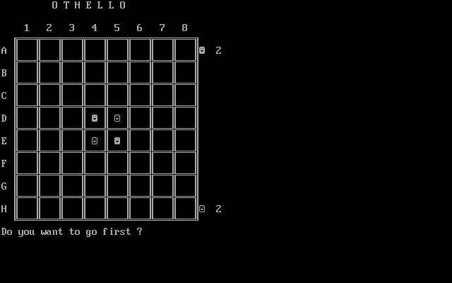
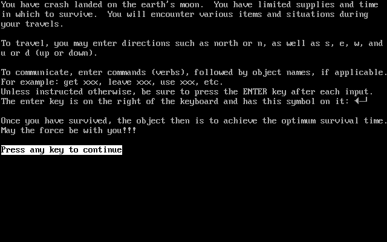

# BASICA-Games

This is a small but classic collection of [BASICA](https://en.wikipedia.org/wiki/IBM_BASIC#IBM_Advanced_BASIC) games (and chess program) from 1984. The origins are unknown, it was simply two floppy disks that appeared soon after an IBM PC 5150 with 5151 monochrome monitor was installed in our graphic arts class for typesetting, one with the BASICA games and the other with an executable chess program.

At some point, I printed out the source listing for the BASICA games which was a good thing because soon after, the floppy disk with the BASICA games slipped behind the wall and the countertop - it's probably still there and will be until the school is torn down.

Over a few days, I painstakingly typed in the code from the printed listings and, because we had two new IBM PCjr PCs with color monitors in the classroom, added color to two of the games.

---

**[ELIZA.BAS](ELIZA.BAS)**: "[**ELIZA**](https://en.wikipedia.org/wiki/ELIZA) is an early natural language processing computer program created from 1964 to 1966 at the MIT Artificial Intelligence Laboratory by Joseph Weizenbaum."

**[OTHELLO.BAS](OTHELLO.BAS)**: "The modern version of the game—the most regularly used rule-set, and the one used in international tournaments—is marketed and recognized as [**Othello**](https://en.wikipedia.org/wiki/Reversi#Othello). It was patented in Japan in 1971 by Goro Hasegawa (legal name: Satoshi Hasegawa), then a 38-year-old salesman. Hasegawa initially explained that Othello was an improvement on Reversi, but from around 2000, he began to claim that he invented it in Mito regardless of Reversi. Hasegawa also claims that the origin of Reversi/Othello dates back 5,000 years."

**[OTHELLOC.BAS](OTHELLOC.BAS)**: Same version as OTHELLO.BAS but with a little color added.

**[SURVIVAL.BAS](SURVIVAL.BAS)**: You have crash-landed on the Earth's Moon. You have limited supplies and time in which to survive. You will encounter various items and situations during your travels. To travel, you may enter directions such as NORTH or N, as well as S, E, W, and U or D (up or down). To communicate, enter commands (verbs), followed by object names, if applicable. For example: GET XXX, LEAVE XXX, USE XXX, etc. Unless instructed otherwise, be sure to press the ENTER key after each input. Once you have survived, the object then is to achieve the optimum survival time.

**[YAHTZEE.BAS](YAHTZEE.BAS)**: "[**Yahtzee**](https://en.wikipedia.org/wiki/Yahtzee) is a dice game made by Milton Bradley (a company that has since been acquired and assimilated by Hasbro). It was first marketed under the name of Yahtzee by game entrepreneur Edwin S. Lowe in 1956. The game is a development of earlier dice games such as Poker Dice, Yacht and Generala. It is also similar to Yatzy, which is popular in Scandinavia."

**[YAHTZEEC.BAS](YAHTZEEC.BAS)**: Same version as YAHTZEE.BAS but with a little color added.

**[CHESS.EXE](CHESS.EXE)**: Not BASICA but an executable program included on the floppies. Good chess game but it cheats; if you put the computer in checkmate, it will remove the threatening piece and move the King to safety. ;)

